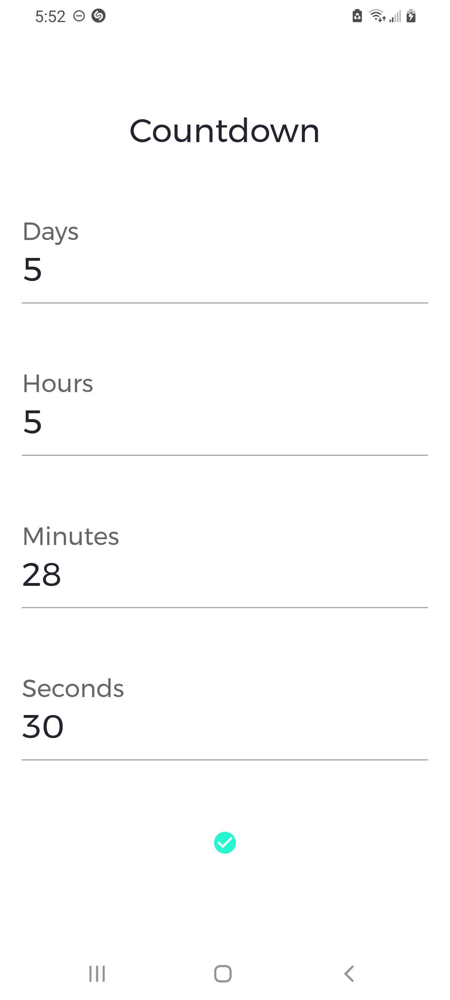
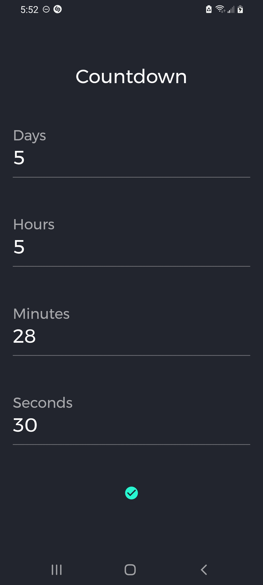
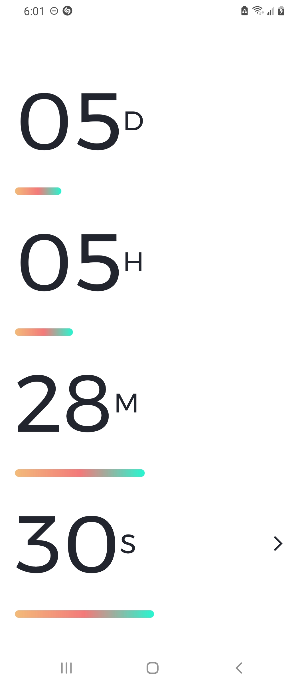
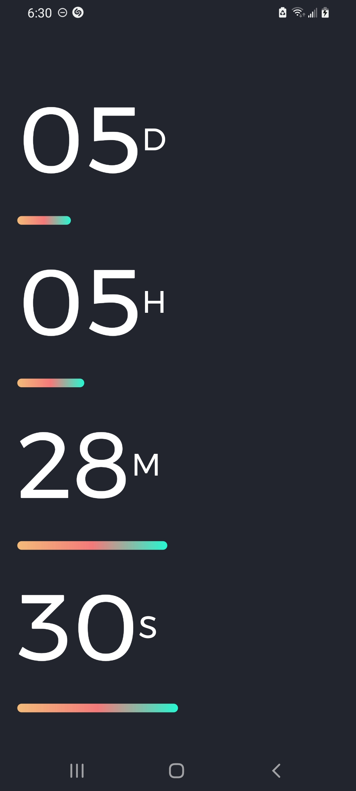
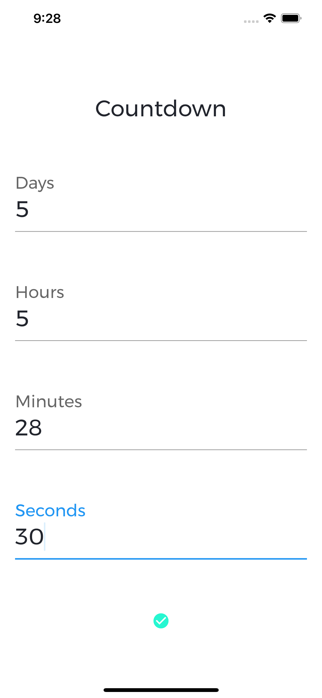
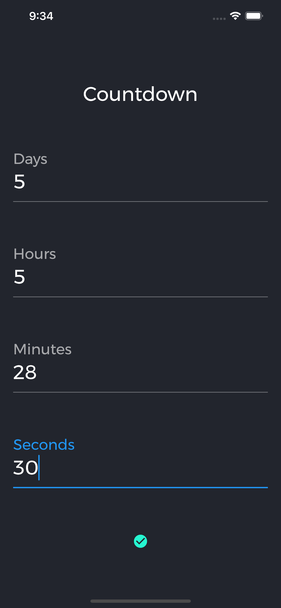
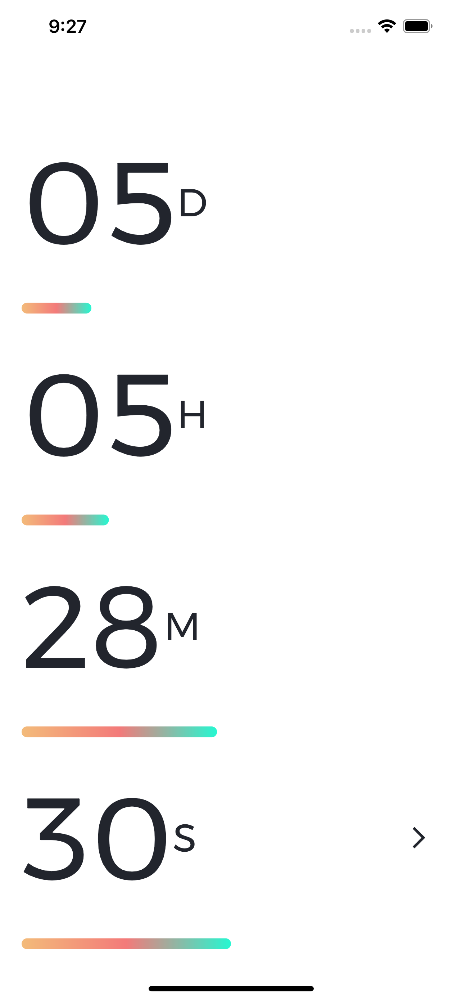
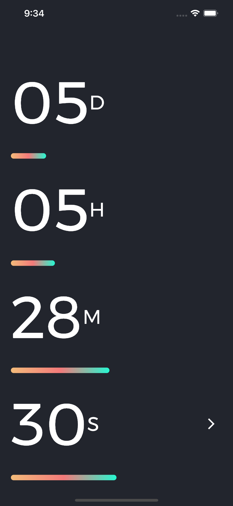

# countdown

A Countdown Timer powered by Flutter

## Overview

Countdown lets you enter a time where it's timer will start counting.

## Screenshots

|||||
|---|---|---|---|
|||||

## Features
- Offline
- Performs countdown with days, hours, minutes, and seconds
- A beautiful user interface.

## Built With
- [Flutter](https://flutter.dev/)
- [Google Fonts](https://pub.dev/packages/google_fonts)
- [AudioPlayers](https://pub.dev/packages/audioplayers)
- [Confetti](https://pub.dev/packages/confetti)
- [Quiver](https://pub.dev/packages/quiver)

## Installation
Clone the repository to your local machine. Open it with a suitable IDE or Visual Studio Code.

## License
Distributed under the MIT License. See `LICENSE` for more information.